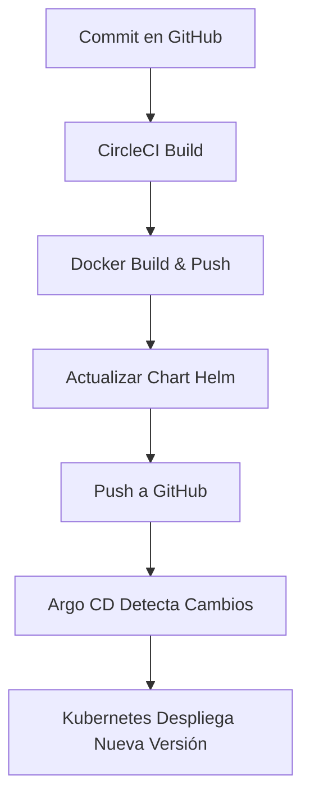

# 🧾 Grupo 2 — Actividad K8S

**Integrantes:**
- Julián David Caicedo Pineda
- Camilo Andrés Porras Martín
- Alexander Caballero García
- Edward Daniel Porras Martín
- Miguel Felipe Hernández Osorio

---

## 🚀 Descripción del proyecto

Este proyecto corresponde a la **Actividad K8S** del componente de Arquitectura de Software.  
Su propósito es desarrollar un **microservicio desplegable mediante Docker**, administrado con **Kubernetes**, configurado con **Helm**, sincronizado con **Argo CD** y automatizado mediante un flujo **CI (CircleCI)**.  

---

## 🧩 Tecnologías utilizadas

| Tecnología | Descripción |
|-------------|--------------|
| **Docker** | Contenedor para empaquetar y ejecutar el microservicio. |
| **Kubernetes** | Orquestador de contenedores para el despliegue. |
| **Helm** | Gestor de paquetes para Kubernetes (Charts y Values). |
| **Argo CD** | Herramienta de entrega continua basada en GitOps. |
| **CircleCI** | Plataforma CI/CD para la construcción y despliegue automático. |
| **GitHub** | Repositorio fuente del proyecto y manifiestos. |

---

## 🧱 Estructura del repositorio

```bash
KubeDocker/
│
├── app/src/                  # Código fuente del microservicio
│   └── main.py               # Archivo principal
│
├── app/Dockerfile            # Imagen base del microservicio
│
├── helm/microservice/        # Helm chart del despliegue
│   ├── Chart.yaml            # Metadatos del chart
│   ├── templates/            # Manifiestos Kubernetes parametrizados
│   └── values.yaml           # Variables configurables
│
├── .circleci/config.yml      # Pipeline de CI/CD
│
└── README.md                 # Documentación del proyecto
```

## 🔄 Flujo CI/CD con CircleCI y Argo CD

1. **Desarrollo:** al realizar un commit en la rama principal (`main`), CircleCI se activa.  
2. **Construcción:** CircleCI construye la imagen Docker y la publica en el registro.  
3. **Actualización:** CircleCI actualiza la versión de la imagen en el chart de Helm.  
4. **Sincronización:** Argo CD detecta el cambio en Git y despliega la nueva versión automáticamente.  

### Diagrama del flujo



---

## 📽️ Entregables

- **Código fuente:** disponible en este repositorio.  
- **Video demostrativo:** muestra todo el flujo de CI/CD, el despliegue con Helm y la sincronización automática en Argo CD.  

---

## 🧠 Conclusiones y aprendizajes

- Se comprendió el flujo completo de un **pipeline CI/CD moderno**.  
- Se aplicaron los principios de **GitOps** utilizando Argo CD.  
- Se consolidó la comprensión de **Helm** como herramienta de empaquetamiento y parametrización de despliegues.  
- Se logró una arquitectura **modular, automatizada y reproducible**, alineada con los objetivos de escalabilidad y mantenibilidad.
